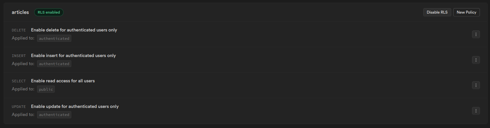
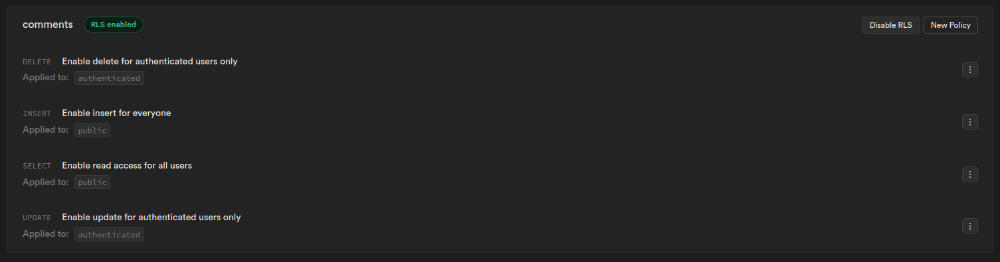
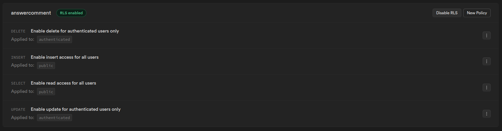

# Notre projet WebTech - Blogging application


*Bienvenue sur le répertoire de notre application web pour WebTech. Vous y trouverez toutes les indications pour le fonctionnement de notre application ainsi que notre propre évaluation.* 

*Pour ce projet, il nous a été demandé de faire un blog sur le sujet que nous voulions. Passionné de basket, nous avons décidé de faire de notre page un blog sur les joueurs de basket.*

## Production

- Vercel URL: https://ece-web-app-hascoet-ndoudi.vercel.app/
- Supabase project URL: https://app.supabase.com/project/xxpeqblsyczvsphynbzo

## Usage

*Pour accéder à notre site, vous pouvez dès à présent vous diriger vers le lien Vercel ci-dessus. Sinon vous pouvez suivre les étapes suivantes. [^1]*

* Cloner ce répertoire avec ssh:
  ```
  git clone git@github.com:Nonoon971/ece-web-app-hascoet-ndoudi.git
  cd ece-web-app-hascoet-ndoudi
  ```
* Ou cloner ce répertoire avec HTTPS:
  ```
  git clone https://github.com/Nonoon971/ece-web-app-hascoet-ndoudi.git
  cd ece-web-app-hascoet-ndoudi
  ```
* Démarrer l'application
  ```bash
  cd www
  # Install dependencies (use yarn or npm)
  npm install
  npm run build
  npm run dev
  ```
* Démarrer Supabase (depuis un autre terminal)
  ```bash
  cd supabase
  docker compose up ...
  ```

## Contributeurs
- NDOUDI Norine <norine.ndoudi@edu.ece.fr>
- HASCOËT Camille <camille.hascoet@edu.ece.fr>

## Tasks
  
**Project management:**

* Naming convention   
  *Nous n'avons pas toujours suivi le naming convention, certaines de nos variables sont en français. 1 point*

* Project structure   
  *Les fichiers et dossiers sont placés comme il nous l'était demandé. 2 points*

* Git   
  *Nous avons un historique de commit riches, conventional commit a été utilisé tôt dans le projet, nous y sommes habituées. 2 points*

* Code quality   
  *La plupart de nos pages sont écrites avec qualité. Cependant certaine page, avec le plus de ligne, n'ont pas reçu le même taux de qualité. 2 points*

* Design, UX, and content   
  *Le site a été testé par des utilisateurs extérieurs pour avoir des retours sur l'expérience utilisateur et l'aspect général. Nous avons pu améliorer ce point. Cependant, nous devons améliorer le visuel du site en mode smartphone/tablette (navbar et players), ainsi que la réactivité pour la sélection des joueurs. 2 point*

**Application development:**

* Home page   
  *Cette page explique clairement le contenu et ce que doit faire l'utilisateur et nous avons rajouté des éléments en lien à notre sujet pour l'esthétisme. Nous souhaitons tout de même améliorer son contenu afin que l'utilisateur dès l'accueil puisse voir des exemples de commentaires et de joueurs proposés. 2 points*

* Login and profile page   
  *Nous avons le bouton dans la navbar pour la connexion qui se transforme en un bouton avec le gravatar lorsque nous sommes connectés. De plus, lorsque l'utilisateur est connecté, il peut accéder à notre page profile contenant les informations de l'utilisateur. Cependant, nous n'avons pas réussi à trouver un moyen d'obtenir le pseudonyme d'un utilisateur inscrit par mail comparé à un utilisateur connecté via GitHub qui verra son pseudo affiché. 3 points*

* New articles creation  
  *Lorsque l'utilisateur est connecté (est seulement quand il l'est), il peut ajouter de nouveaux joueurs dans la page "player" avec le bouton prévue. Le bouton nous redirige vers une autre page avec un formulaire. 6 points*

* New comment creation   
  *Tous les utilisateurs, dans la page explicative de chaque joueur : /posts/[id].js, peuvent laisser un commentaire, de plus, ceux-ci peuvent aussi répondre à d'autre commentaire (bonus). 4 points*

* Resource access control   
  *Dans supabase, nous avons utilisé les fonctionnalités RLS afin de réguler l'accès à certaines fonctionnalités pour les utilisateurs connecté et non connecté et l'affichage des éléments. Nous les avons utilisés sur l'affichage de tous les articles, l'affichage de chaque article et la page profile. Ci-dessous sont les screens de supabase. 6 points*

  
  
  

* Article modification   
  *L'utilisateur qui a créé l'article voit un bouton "modifier" en haut à droite de l'espace de présentation du joueur. Ce bouton dirige vers une autre page où chacun des éléments peut être modifiés avec un module qui s'affiche en fonction de l'élément à modifier. Pour voir les modifications, l'utilisateur doit se rediriger vers la page de l'article. 4 points*

* Article removal   
  *Si l'utilisateur connecté à créé le joueur qui est affiché alors celui-ci peut appuyer sur un bouton qui ne s'affiche que pour lui afin de supprimer le joueur. Dans notre table article dans supabase nous avons un attribut user_id qui est relié à l'utilisateur. Nous vérifions alors si l'user_id match l'id de l'utilisateur connecté. 2 points*

* Comment modification   
  *L'utilisateur qui a laissé un commentaire peut alors appuyer sur le bouton "modifier" en dessous de son commentaire. Cela affichera un module en haut de la page où il pourra modifier son commentaire. Cependant, lorsque l'on souhaite modifier plusieurs commentaires, il arrive parfois que l'ID du commentaires soit faussé par l'ancienne sélection. Nous avons pas encore trouvé de moyen pour y remédier. 1,5 points*

* Comment removal   
  *Comme pour la modification un bouton que seul le créateur du commentaire peut voir lui permettra de supprimer celui-ci. Comme pour la modification, nous avons rencontré le même problème que ci-dessus. 1,5 points*

* Account settings   
  *Dans la page "profile" de l'utilisateur, un bouton en forme d'engrenage amène à une page de modification du profil. Dans celle-ci, si l'utilisateur est connecté grâce à GitHub, il verra un lien vers github. S'il est connecté avec un mail alors il aura la possibilité de changer son mot de passe ou son mail. Nous pouvons voir la modification du mail, mais celle-ci n'aura aucun réél effet. 4 points*

* WYSIWYG integration   
  *À faire. Ce point est à ajouter dans un futur proche afin d'améliorer notre application web. 0 points*

* Gravatar integration   
  *Lorsque l'utilisateur se connecte, celui-ci voit dans la navbar sont gravatar, pour les commentaires et réponse, ainsi que dans la page profile. 2 points*

* Light/dark theme   
  *La modification du thème est effective sur toutes les pages, le fond, les boutons et les div sont modifié en fonction du choix de l'utilisateur. 2 points*

* Accent color selection   
  *À faire. Ce point est à ajouter dans un futur proche afin d'améliorer notre site web. 0 points*


## Bonus

* Page profile   
  *Vous pouvez voir le mail de l'utilisateur, la façon dont l'utilisateur est connecté ainsi que les commentaires et les articles créés*

* Réactions aux commentaires  
  *Vous pouvez répondre à un commentaire en dessous de chaque commentaire principal.*

[^1]: Supabase ayant besoin de .env pour fonctionner avec les étapes au-dessus, vous ne pourrez pas faire fonctionner notre supabase local. Cependant Paul Farrault à êtes ajouté à notre supabase online.

> *Rien ne sert de courir, il faut partir à point*.
