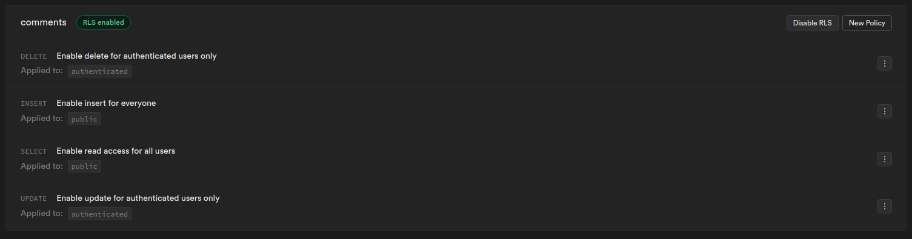
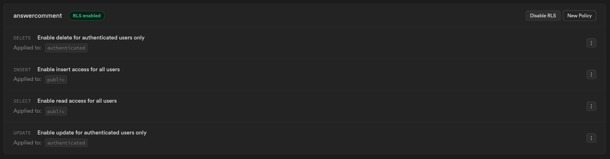

# Our WebTech project - Blogging application

*Welcome to our web application repository for the Web Technologies class. You'll find all the information you need to use our application, as well as our own evaluation.*

*For this project, we were asked to make a blog on the subject we wanted. Passionate about basketball, we decided to make our page a blog about basketball players.*

## Production

- Vercel URL: https://ece-web-app-hascoet-ndoudi.vercel.app/
- Supabase project URL: https://app.supabase.com/project/xxpeqblsyczvsphynbzo

## Usage

*To access our application, you can now go to the Vercel link above[^1]. Alternatively, you can follow the steps below. [^2]*

* Clone this repository with ssh:
  ```
  git clone git@github.com:Nonoon971/ece-web-app-hascoet-ndoudi.git
  cd ece-web-app-hascoet-ndoudi
  ```
* Or clone this repository with HTTPS:
  ```
  git clone https://github.com/Nonoon971/ece-web-app-hascoet-ndoudi.git
  cd ece-web-app-hascoet-ndoudi
  ```
* Start the application:
  ```bash
  cd www
  # Install dependencies (use yarn or npm)
  npm install
  npm run build
  npm run dev
  ```
* Start Supabase (from another terminal)
  ```bash
  cd supabase
  docker compose up ...
  ```

## Contributors
- NDOUDI Norine <norine.ndoudi@edu.ece.fr>
- HASCOËT Camille <camille.hascoet@edu.ece.fr>

## Tasks
  
**Project management:**

* Naming convention   
  *We don't always follow the naming convention, some of our variables are in French. 1 point*

* Project structure   
  *Files and folders are placed as requested. 2 points*

* Git   
  *We have a rich commit history. The conventional commits were used early in the project, so we're used to it. 2 points*

* Code quality   
  *Most of our pages are written with quality. However, some pages, with the most lines, have not received the same level of quality. 2 points*

* Design, UX, and content   
  *The application was tested by external users to get feedback on the user experience and overall look and feel. We were able to improve on this point. However, we need to improve the application's visuals in smartphone/tablet mode (navbar and players), as well as the responsiveness of player selection. 2 point*
  
**Application development:**

* Home page   
  *This page clearly explains the content and what the user has to do, and we've added some elements related to our subject for aesthetics. However, we'd still like to improve the content so that, right from the start, users can see examples of comments and players. 2 points*

* Login and profile page   
  *We have the button in the navbar for logging in, which turns into a button with the gravatar when we're logged in. In addition, when the user is logged in, he can access his profile page containing the user's information. However, we haven't managed to find a way of obtaining the pseudonym of a user registered by e-mail, as opposed to a user connected via GitHub, whose pseudonym will be displayed. 3 points*

* New articles (players here) creation  
  *When the user is logged in (and only when logged in), he can add new players to the “player” page using the button provided. The button redirects us to another page with a form. 6 points*

* New comment creation   
  *All users can leave a comment on each player's explanatory page: /posts/[id].js, and they can also reply to other comments (bonus). 4 points*

* Resource access control   
  *In supabase, we've used RLS features to regulate access to certain functionalities for logged-in and logged-out users and the display of items. We used them on the display of all items, the display of each item and the profile page. Below are the supabase screenshots: 6 points*
  
  
  

* Article (players here) modification   
  *The user who created the player's post will see an “edit” button in the top right-hand corner of the player's presentation area. This button redirects the user to another page where each of the elements can be modified, with a module displayed according to the element to be modified. To see the modifications, the user must redirect to the player's page. 4 points*

* Article (players here) removal   
  *If the logged-in user has created the player displayed, then he can press a button displayed only for him to delete the player. In our article table in supabase we have a user_id attribute which is linked to the user. We then check whether the user_id matches the id of the logged-in user. 2 points*

* Comment (players here) modification   
  *Users who have left a comment can then press the “edit” button below their comment. This will display a module at the top of the page where they can edit their comment. However, when editing multiple comments, it sometimes happens that the comment ID is incorrectly displayed by the old selection. We haven't yet found a way to remedy this. 1,5 points*

* Comment (players here) removal
  *As with comment editing, a button that only the comment creator can see will allow him/her to delete the comment. As with comment editing again, we encountered the same problem as above. 1,5 points*

* Account (players here) settings   
  *On the user's “profile” page, a gear-shaped button leads to a profile modification page. Here, if the user is connected via GitHub, he'll see a link to github. If they're connected via e-mail, they'll be able to change their password or e-mail address. We can see the e-mail modification, but it will have no real effect. 4 points*

* WYSIWYG integration   
  *To do. This point is to be added in the near future to improve our web application. 0 points*

* Gravatar integration   
  *When the user logs in, they see their gravatar in the navbar, for comments and replies, as well as in the profile page. 2 points*

* Light/dark theme   
  *Theme modification is effective on all pages, with background, buttons and divs modified according to the user's choice. 2 points*

* Accent color selection   
  *To do. This point is to be added in the near future to improve our web application. 0 points*


[^1]: If you're using the Vercel link, some features using Supabase are currently unavailable because our database is paused. Contact us in order to use to reactivate it.
[^2]: Since Supabase needs .env to work with the steps above, you won't be able to run our local supabase. You'll need to create your own environment variables.
